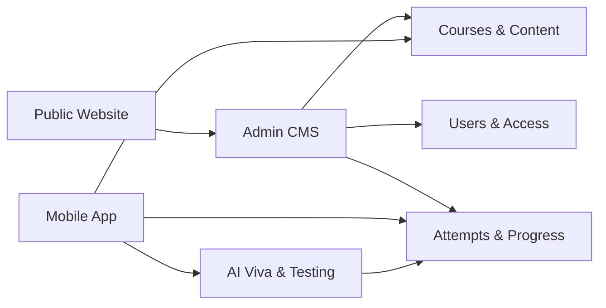

# Urologics Platform

Urologics is a premium digital learning ecosystem for FRCS Urology preparation, combining structured course delivery, mobile-first learning, AI viva simulation, mock examinations, video content, analytics, and admin-controlled access management.

The platform is built as a connected product suite: a marketing website, an admin CMS, a React Native learner app, and an AI-powered testing/viva experience. Together, they support the complete journey from discovery and registration to course access, practice, assessment, feedback, and progress tracking.

<p align="center">
  
</p>

## Product Overview

Urologics is designed for a specialized medical education business where candidates need high-quality content, guided preparation, mock exam practice, and measurable improvement. The system brings content management, learning access, assessments, AI practice, user management, and mobile delivery into one operational platform.

It supports:

- A public-facing website for brand positioning, pricing, testimonials, course discovery, and lead conversion.
- A private admin dashboard for managing learning content, users, courses, videos, quizzes, mocks, viva cases, pricing, testimonials, announcements, and notifications.
- A mobile learner app for iOS and Android with course access, quizzes, videos, bookmarks, progress tracking, AI viva practice, and user profiles.
- A dedicated testing and AI viva experience for mock exams, viva sessions, scoring, feedback, and public practice flows.

## Key Business Features

- **Course Management**: Create and organize premium learning programs such as FRCS Section 1, FRCS Section 2, AI Viva, mentorship, and mock-based offerings.
- **Content Delivery**: Manage videos, chapters, quizzes, mocks, grand mocks, and AI viva cases from the admin dashboard.
- **User Access Control**: Assign users to courses, separate guest/free/paid learners, and control what each learner can access.
- **Mobile Learning Experience**: Deliver structured preparation through an Expo React Native app across iOS and Android.
- **AI Viva Practice**: Simulate viva-style preparation with AI-driven questioning, scoring, feedback, and usage-based viva credits.
- **Assessment Engine**: Support chapter quizzes, daily quizzes, mocks, grand mocks, attempts, explanations, review flows, and performance history.
- **Video Learning Library**: Connect Google Drive and cloud storage workflows for managing educational videos and playback access.
- **Pricing and Plan Management**: Create course-linked plans, categories, coupons, and premium access offerings.
- **Communication Tools**: Manage announcements, notifications, testimonials, feedback collection, and support flows.
- **Compliance-Oriented UX**: Includes account deletion support, profile upgrade flows, access checks, and app review-friendly support paths.

## Platform Modules



## Technology Stack

| Area | Technologies |
| --- | --- |
| Web Platform | Next.js, React, TypeScript, Tailwind CSS |
| Admin CMS | Next.js App Router, React Server Components, reusable dashboard UI |
| Mobile App | Expo, React Native, Expo Router, NativeWind |
| Backend | Next.js Route Handlers, Firebase Admin SDK, Node.js services |
| Database & Auth | Firebase Authentication, Firestore |
| Media & Storage | Google Drive API, Google Cloud Storage, Cloudinary |
| AI & Voice | Gemini, Google AI tooling, Google text-to-speech/speech services |
| Deployment | Vercel, Firebase, Google Cloud |
| UI & DX | Radix UI, Lucide Icons, ESLint, TypeScript |

## Connected Applications

- **Urologics CMS**: The main web/admin platform in this repository.
- **Urologics Mobile App**: Expo React Native learner app for iOS and Android.
- **Urologics Testing Zone**: Web-based mock exam and AI viva platform.

## Repository Highlights

- Business-ready admin dashboard for managing a real education product.
- Course-based access model suitable for premium subscriptions or manually assigned cohorts.
- Mobile-first API design powering the learner app.
- AI viva and assessment workflows integrated into the learning journey.
- Cloud-backed media handling for video and image assets.
- Production-focused structure with typed services, reusable components, and deployment-ready scripts.

## Getting Started

```bash
npm install
npm run dev
```

Open:

```txt
http://localhost:3000
```

Production build:

```bash
npm run build
npm run start
```

## Scripts

- `npm run dev` - Start the development server.
- `npm run build` - Create a production build.
- `npm run start` - Run the production server.
- `npm run lint` - Run ESLint.
- `npm run migrate:firestore` - Run Firestore migration utilities.
- `npm run import:grand-mock-1` - Import bundled grand mock content.

## Environment

The platform uses Firebase, Google Cloud, Google Drive, Cloudinary, and AI provider credentials. Secrets should be configured through `.env.local` during development and secure environment variables in production.
